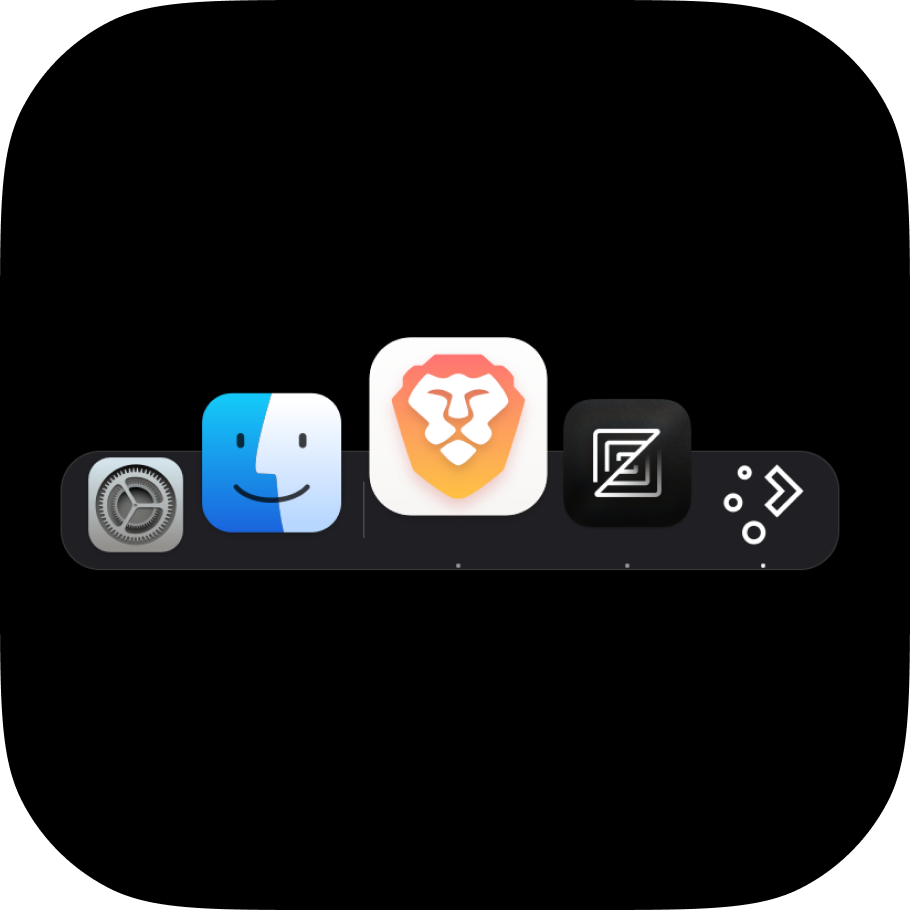
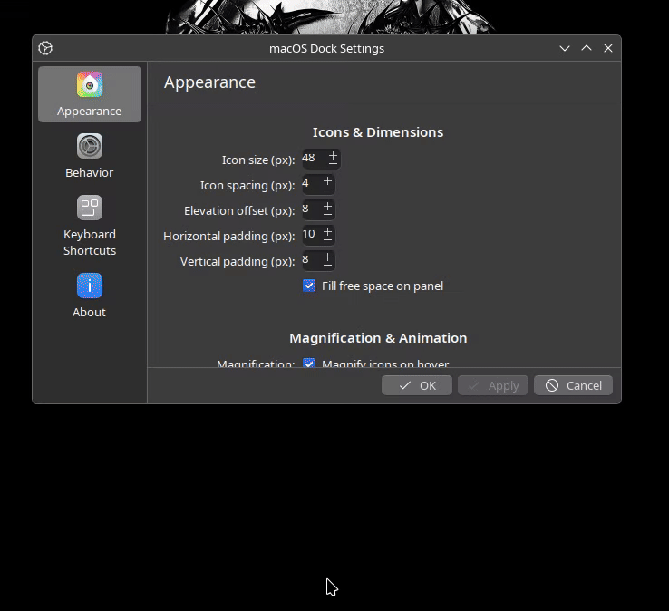
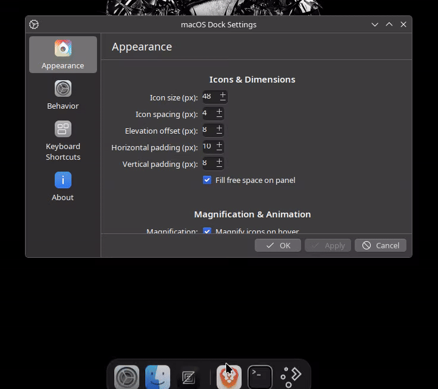
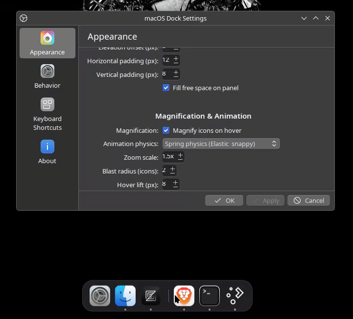
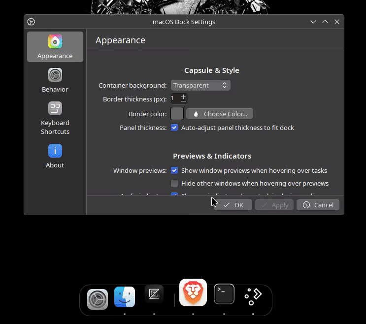
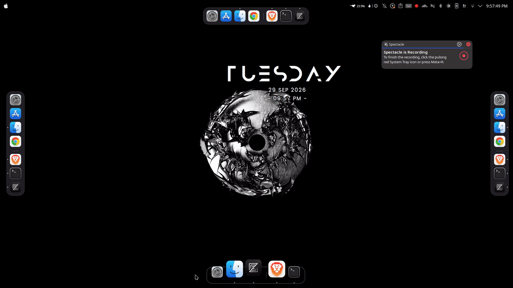

<p align="center">
  
</p>

# macOS Dock-Like Experience for KDE Plasma 6

A native widget for KDE Plasma 6 that brings a smooth, responsive macOS dock-like experience to your Linux desktop. Built directly on top of KDE's official Icons-Only Task Manager, it transforms the taskbar into a floating, magnified capsule while keeping all native Plasma system integrations, Wayland window management, and application workflows fully intact.

## Table of Contents

- [Installation](#installation)
- [Compatibility](#compatibility)
- [Introduction](#introduction)
- [Features](#features)
  - [Custom Icon Sizing and Spacing](#custom-icon-sizing-and-spacing)
  - [Capsule Padding and Edge Elevation](#capsule-padding-and-edge-elevation)
  - [Auto-Shrinking and Progressive Magnification](#auto-shrinking-and-progressive-magnification)
  - [Interactive Magnification Wave](#interactive-magnification-wave)
  - [Spring and Smooth Animation Physics](#spring-and-smooth-animation-physics)
  - [Hover Lift Elevation](#hover-lift-elevation)
  - [Capsule Styling, Native Blur, and Liquid Glass](#capsule-styling-native-blur-and-liquid-glass)
  - [External Running Indicator Dots](#external-running-indicator-dots)
  - [Pinned and Running Tasks Divider](#pinned-and-running-tasks-divider)
  - [All-Edge Screen Placement Support](#all-edge-screen-placement-support)
- [How It Works and Architectural Decisions](#how-it-works-and-architectural-decisions)
  - [Why Build on Icons-Only Task Manager](#why-build-on-icons-only-task-manager)
  - [Sub-Region KWin Blur via KWindowEffects](#sub-region-kwin-blur-via-kwindoweffects)
  - [Cosine-Squared Parabolic Wave Math](#cosine-squared-parabolic-wave-math)
  - [Dynamic Layering and Elevated Hitbox Protection](#dynamic-layering-and-elevated-hitbox-protection)
  - [Padding-Anchored Status Dots](#padding-anchored-status-dots)
  - [Edge-Aware Coordinate Transformations](#edge-aware-coordinate-transformations)
  - [Unified Configuration Architecture](#unified-configuration-architecture)
- [Recommended Setup](#recommended-setup)
- [Known Limitations](#known-limitations)
- [License](#license)

---

## Installation

### Installation from Source (With Blur Support)

1. Clone this repository:

   ```bash
   git clone https://github.com/Matt-Anis/plasma-macos-dock.git
   cd plasma-macos-dock
   ```

2. Build and install the C++ blur module and widget:

   ```bash
   cmake -B build -S .
   cmake --build build
   sudo cmake --install build
   ```

3. Restart Plasma Shell to load the new QML plugin and widget:

   ```bash
   systemctl --user restart plasma-plasmashell
   ```

4. Right-click your desktop or an existing panel, select **Add Widgets...**, and add **macOS Dock** to your screen.

> [!TIP]
> **Prefer a lightweight version without C++ build dependencies?**  
> If you prefer a pure QML/JS version that requires no compilation or build tools, check out the [`without-blur` branch](https://github.com/Matt-Anis/plasma-macos-dock/tree/without-blur).

---

## Compatibility

> [!WARNING]
> **Testing Status**: This widget was developed and **tested exclusively on KDE Plasma 6.6**. While it is built to target baseline Plasma 6 specifications, backward compatibility with older point releases (Plasma 6.0 through 6.5) is theoretical and has not yet been verified across different distributions. If you encounter issues on earlier Plasma 6 versions, please report them!

### Requirements

| Component | Minimum Version | Notes |
| :--- | :--- | :--- |
| **KDE Plasma** | `6.0.0+` | **Not compatible with KDE Plasma 5** |
| **KDE Frameworks (KF6)** | `6.0.0+` | Requires `kirigami`, `ksvg`, `kwindowsystem`, `kcmutils` |
| **Qt** | `6.6.0+` | Built on Qt 6 Quick layouts and components |

### Build Dependencies
To compile the native C++ blur module on this branch, ensure your system has development packages installed:
- `cmake` (>= 3.16) and a C++17 compiler (`gcc-c++` or `clang`)
- `extra-cmake-modules` (ECM)
- `kf6-kwindowsystem-devel` (or `libkf6windowsystem-dev`)
- `qt6-base-devel`, `qt6-declarative-devel`

### Required Runtime Packages
Most standard Plasma 6 desktop installations include these by default, but minimal distributions (e.g., minimal Arch, Gentoo, Fedora Minimal) may require installing them explicitly:

- `qt6-5compat` (provides `Qt5Compat.GraphicalEffects` for shader fallbacks)
- `plasma-workspace` (provides `libtaskmanager`, DBus helpers, and MPRIS controls)
- `plasma-pa` (provides audio stream indicators on task badges)
- `kpipewire` (provides live window preview thumbnails)

---

## Introduction

This widget provides a macOS dock-like experience inside KDE Plasma 6. It is built directly on KDE's native Icons-Only Task Manager codebase (`org.kde.plasma.icontasks`), replacing the standard flat panel look with an elevated floating dock capsule, fluid icon magnification, and refined visual styling without sacrificing stability or Wayland compatibility.

---

## Features

### Custom Icon Sizing and Spacing

Unlike standard taskbars where icon size is constrained by panel height, this dock lets you define custom icon dimensions and spacing independently.

- **How to use**: Open dock settings under **Appearance > Icons & Dimensions**. Use the **Icon size (px)** spinbox to set your base icon size (from 24px up to 256px), and adjust **Icon spacing (px)** to control the gap between neighboring icons.
- **Visual preview**:

  

### Capsule Padding and Edge Elevation

The dock sits inside a floating capsule with customizable inner padding and an elevation offset that lifts the entire dock away from the monitor edge.

- **How to use**: In dock settings under **Appearance > Icons & Dimensions**, configure **Horizontal padding (px)** and **Vertical padding (px)** to control inner capsule margins around icons. Adjust **Elevation offset (px)** to raise the dock above the screen edge.
- **Visual preview**:

  

### Auto-Shrinking and Progressive Magnification

When many applications are opened or pinned, the dock prevents screen overflow by dynamically scaling down icons and spacing in real time to fit comfortably within monitor bounds (with a minimum 16px floor). As icons compress, the magnification multiplier automatically scales up progressively ($(\text{preferredSize} / \text{currentSize})^{0.75}$), ensuring that even miniature icons on an ultra-dense dock blow up to an easily recognizable, readable size on hover.

- **How to use**: This behavior is automatic. As you launch or pin more tasks exceeding your monitor width or height, the dock smoothly compresses icons to fit, expanding them back to your preferred size as windows close.
- **Visual preview**:

  

### Interactive Magnification Wave

Hovering over dock icons triggers a smooth, continuous magnification wave where the target icon expands and neighboring icons scale progressively according to proximity.

- **How to use**: In dock settings under **Appearance > Magnification & Animation**, turn on **Magnify icons on hover**. Use the **Zoom scale** spinbox to choose the peak magnification factor (from 1.0x up to 2.0x), and set the **Blast radius (icons)** to specify how many neighboring icons scale alongside the hovered icon (1 to 4 items on each side).
- **Visual preview**:

  

### Spring and Smooth Animation Physics

You can choose between physical spring simulation or cubic easing curves for icon magnification.

- **How to use**: In dock settings under **Appearance > Magnification & Animation**, select your preference in the **Animation physics** dropdown:
  - **Spring physics**: Employs elastic simulation with subtle damping for a bouncy, tactile feel.
  - **Smooth**: Uses a clean cubic ease-out curve for steady, linear transitions.

### Hover Lift Elevation

When icons magnify on hover, they can simultaneously lift upward away from the panel base toward the cursor.

- **How to use**: Under **Appearance > Magnification & Animation**, adjust the **Hover lift (px)** spinbox (from 0px up to 32px). Higher values make icons elevate toward the mouse cursor as they scale up.

### Capsule Styling, Native Blur, and Liquid Glass

The dock background capsule can be styled in four distinct visual modes:

- **Solid**: Flat or tinted surface using your chosen custom background color.
- **Transparent**: Completely invisible container with icons floating directly above the wallpaper.
- **System Blur**: Uses KWin's compositor to dynamically blur only behind the rounded capsule area (leaving the rest of the transparent panel unblurred).
- **Liquid Glass**: Combines live KWin background blur with an internal specular gloss sheen, tinted translucency, and a sharp border.

#### Live Blur & Glass Tuning Steppers
When **System Blur** or **Liquid Glass** is active, you can fine-tune the optical presentation directly from the settings using native steppers:
- **Capsule opacity**: Stepper from 5% to 95% (step 5%) controlling background tint vs blur passthrough.
- **Vibrancy (saturation)**: Stepper from 0.0x to 2.0x (step 0.1x) boosting wallpaper color vibrancy behind the blur for an authentic macOS look.
- **Blur contrast**: Stepper from 0.5x to 1.5x (step 0.1x) adjusting shape contrast behind the glass.
- **Blur brightness**: Stepper from 0.5x to 1.5x (step 0.1x) adjusting background illumination.

- **How to use**: In dock settings under **Appearance > Capsule & Style**, select your preferred mode in **Container background**. Adjust the border thickness, border color, and blur tuning steppers to taste.
- **Visual preview**:

  

### External Running Indicator Dots

Running applications display a subtle indicator dot placed in the capsule padding beneath the icon rather than drawn over the icon graphic itself.

- **How to use**: In dock settings under **Appearance > Previews & Indicators**, check **Show indicator for running applications**. The indicator glows bright white for the active window and dims to soft translucent white for background or minimized windows.

### Pinned and Running Tasks Divider

The dock automatically generates a subtle vertical or horizontal separator line between your pinned application launchers and unpinned running windows.

- **How to use**: Pin favorite applications to your dock. When you open an unpinned app, a clean translucent divider appears automatically between the launcher section and the open window section.

### All-Edge Screen Placement Support

The dock works on any screen edge, automatically adjusting its orientation, lift direction, indicator offset, and popup placement.

- **How to use**: Place your Plasma panel on the Bottom, Top, Left, or Right edge of your display. The dock detects the screen edge automatically, rotating the capsule layout, directing icon hover lift inward toward the desktop, and adjusting indicator dot positions.
- **Visual preview**:

  

---

## How It Works and Architectural Decisions

### Why Build on Icons-Only Task Manager

Developing a dock as an independent application often leads to window management desynchronization, Wayland protocol incompatibilities, missing system tray coordination, and duplicate resource consumption.

Building directly upon KDE Plasma's `org.kde.plasma.icontasks` keeps all native window tracking, LibTaskManager models, virtual desktop filters, activity assignments, window thumbnails, and MPRIS audio stream controls native to the shell. This delivers an authentic dock experience without third-party daemons or compositor workarounds.

### Sub-Region KWin Blur via KWindowEffects

In Plasma on Wayland, KWin typically applies background blur to entire top-level window surfaces. Because the dock capsule is an elevated floating element inside a larger transparent panel (`NoBackground`), applying window-level blur would create an unseemly rectangular blur slab spanning the full width or height of the screen.

To solve this, the widget incorporates a native C++ QML item (`DockBlurArea`):

1. **Scene Coordinate Mapping**: The item continuously projects its local capsule bounding box and corner radius into the top-level panel window coordinates via `mapRectToScene()`.
2. **Rounded Polygon Region**: It constructs a precise `QRegion` from a `QPainterPath` rounded rectangle that matches the capsule's dynamic width, height, and corner radius.
3. **KWin Compositor Hooks**: It passes this region to `KWindowEffects::enableBlurBehind()` and `KWindowEffects::enableBackgroundContrast()`. KWin's compositor blurs and color-tunes strictly behind the capsule pill while keeping the surrounding panel completely transparent.

### Cosine-Squared Parabolic Wave Math

Magnification calculation in `main.qml` uses a normalized cosine-squared curve rather than a simple linear step function:

```text
distance = abs(iconIndex - hoveredIndex)
u = distance / (blastRadius + 1)
factor = (0.5 * (1 + cos(pi * u)))^2
```

This mathematical formula produces a smooth bell curve whose first derivative approaches zero at the boundary edges. Neighboring icons ease into expansion gradually and return to rest without abrupt jumps or snapping artifacts.

### Dynamic Layering and Elevated Hitbox Protection

When icons scale up and lift toward the mouse cursor, standard layouts frequently suffer from overlapping z-order glitches or lose pointer hover as the icon geometry shifts. Two architectural choices resolve this:

1. **Dynamic Stacking Order**: Each task item computes its `z` property dynamically from its instantaneous zoom level (`Math.round(effectiveZoom * 100)`). The hovered icon always renders in front of its immediate neighbors, which in turn render in front of resting icons.
2. **Elevated Hitbox Extension**: A dedicated `hoverHitBox` item projects outward into the panel padding by `maxElevatedReach`. Even when an icon lifts 20px or 30px off the dock floor, the mouse cursor remains inside the interactive area, preventing hover flickering.

### Padding-Anchored Status Dots

In standard KDE taskbars, running indicators overlay the bottom edge of application graphics, often clashing with icon artwork.

In this dock, running indicator dots are anchored outside the icon box into the dock capsule padding margin (`padOffset`). By calculating the remaining margin between the icon edge and the capsule border, indicators float in the dedicated padding cushion, leaving application icons completely unobstructed.

### Edge-Aware Coordinate Transformations

KDE Plasma panels can be positioned on any monitor edge. Rather than assuming a bottom-panel setup, the dock evaluates an internal `effectiveLocation` property:

- Checks whether the dock is horizontal (`BottomEdge` or `TopEdge`) or vertical (`LeftEdge` or `RightEdge`).
- Automatically directs hover lift transformations inward toward the workspace.
- Anchors indicator dots into the appropriate outer padding margin (bottom, top, left, or right).
- Aligns context menus and window preview popups so they always open away from the screen edge.

### Unified Configuration Architecture

The configuration backend extends KDE's `kcfg` schema with explicit definitions for every dock parameter (`iconSize`, `elevation`, `zoomMultiplier`, `containerBackgroundColor`, and related properties). The UI is organized into dedicated sections within Kirigami form layouts, giving users immediate access to dimensions, physics, colors, and behavior without burying options in unrelated submenus.

---

## Recommended Setup

For the most authentic dock presentation:

1. **Plasma Panel Settings**:
   - Panel mode: Set to **Fit Content** or centered floating.
   - Opacity: Set panel background to **Transparent** so the dock capsule renders its own background.
2. **Dock Settings**:
   - **Icons & Dimensions**: Icon size `48px`, Icon spacing `4px`, Elevation `8px`.
   - **Magnification & Animation**: Zoom scale `1.5x`, Blast radius `2`, Animation `Spring physics`, Hover lift `12px`.
   - **Capsule & Style**: Border thickness `1px`, Container background `Solid`.

---

## Known Limitations

- **No UV Refraction / Background Distortion**: While native background blur, saturation boosting, contrast adjustment, and internal surface gloss are fully supported, optical warping and UV refraction of desktop windows behind the dock are not implemented. Under Wayland, client widgets are strictly isolated from desktop framebuffers for security reasons; reading and distorting background pixels requires writing a low-level C++ KWin compositor effect (`kwin_wayland` plugin). KWin's internal C++ API changes frequently across point releases, and any crash in a compositor effect crashes the user's entire desktop session and logs them out. To keep your system completely stable and safe from session crashes, optical UV distortion of background windows was deliberately omitted.

---

## License

This project is licensed under the GNU General Public License v2.0 or later (GPL-2.0-or-later). See the project files for full copyright and licensing details.
